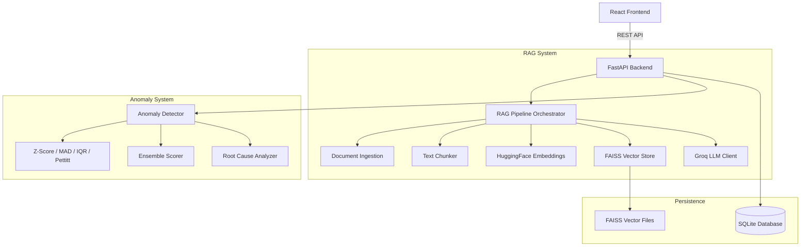

---
tags:
  - #hub
  - #architecture
---
# 🏛️ 01 System Architecture

> **Master Hub**: [[00_Master_Hub]]

---

## 🔄 End-to-End Subsystem Connections

---

## 🔗 Direct Links to Subsystem Hubs

- [[02_RAG_Pipeline_Hub]]
- [[03_Statistical_Anomaly_Hub]]
- [[04_Root_Cause_Engine_Hub]]
- [[05_FastAPI_Backend_Hub]]
- [[06_Frontend_App_Hub]]
